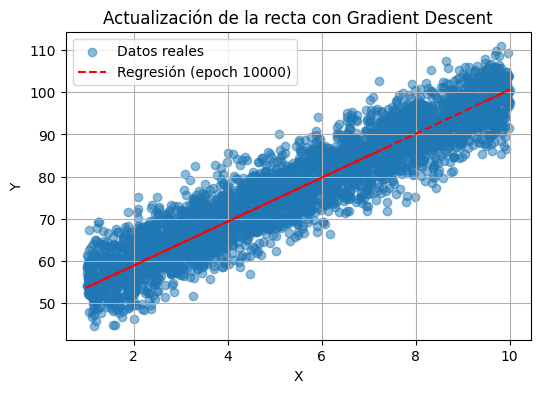

# Linear Regression Implementation from Scratch

## Overview
This project implements Linear Regression from scratch using Gradient Descent as the optimization method. The implementation is compared with scikit-learn's LinearRegression to validate its accuracy. While the exact weight (w) and bias (b) values might differ slightly, the overall performance is comparable.

## Project Description
The project demonstrates the following key components:

1. **Data Generation**
   - Creates synthetic data for study hours vs. exam scores
   - Includes random noise for realistic data simulation
   - Generates 5000 data points for robust model training

2. **Data Split**
   - Training set (80%): 4000 samples
   - Validation set (10%): 500 samples
   - Test set (10%): 500 samples

3. **Implementation Details**
   - Custom implementation of Linear Regression using Gradient Descent
   - Mean Squared Error (MSE) as the cost function
   - Visualization of the regression line's evolution during training
   - Real-time loss tracking for both training and validation sets
  

4. **Features**
   - Interactive visualization of the training process
   - Comparison with scikit-learn's implementation
   - Performance metrics calculation (MSE, MAE, R², MAPE)
   - Learning rate and epoch parameter tuning

## Requirements
- Python 3.x
- NumPy
- Matplotlib
- scikit-learn

## Usage
The implementation is provided in a Jupyter notebook format (.ipynb) which can be run in any Jupyter environment. The notebook includes detailed comments and explanations for each step of the implementation.

## Results
The implementation successfully demonstrates:
- The gradient descent optimization process
- Convergence to optimal parameters
- Comparable performance to scikit-learn's implementation
- Visual representation of the learning process

## Author
Jorge Molto